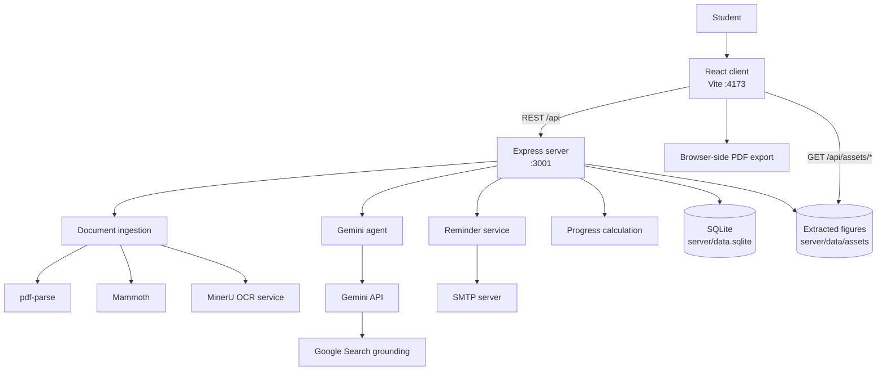
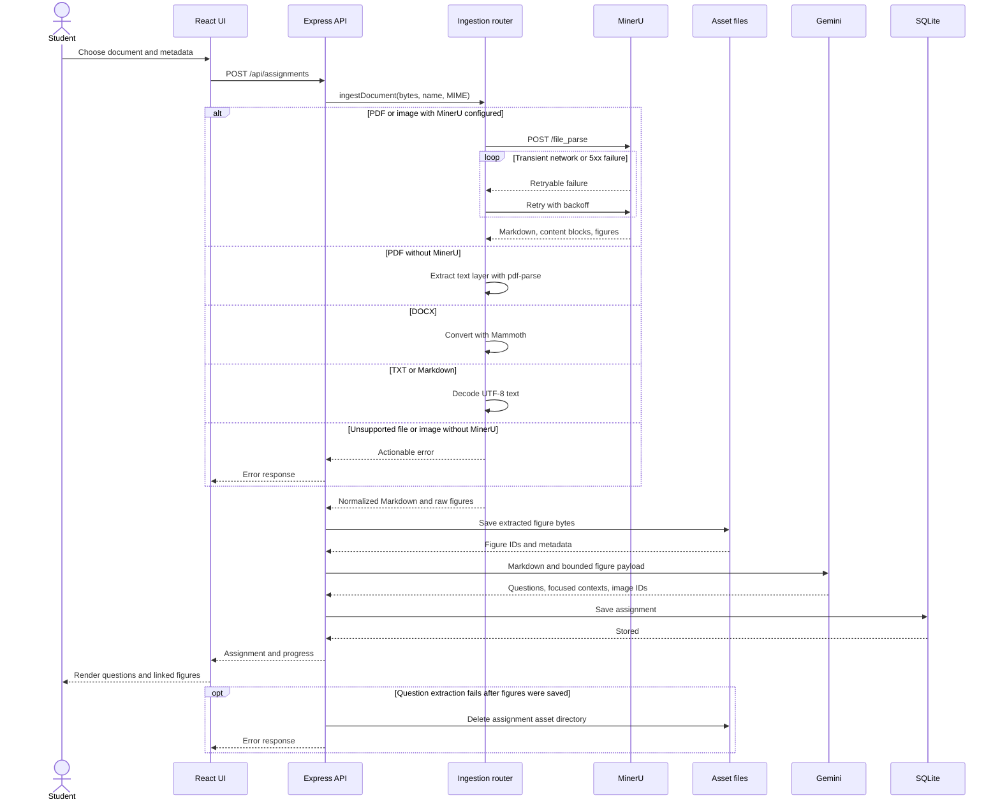
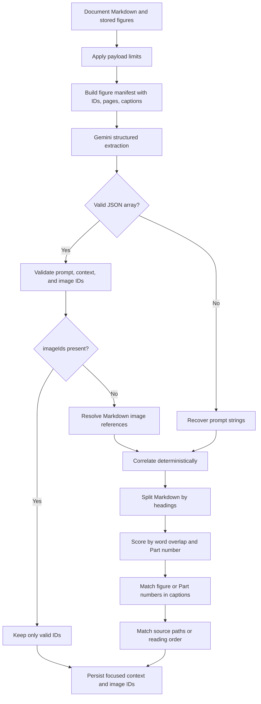
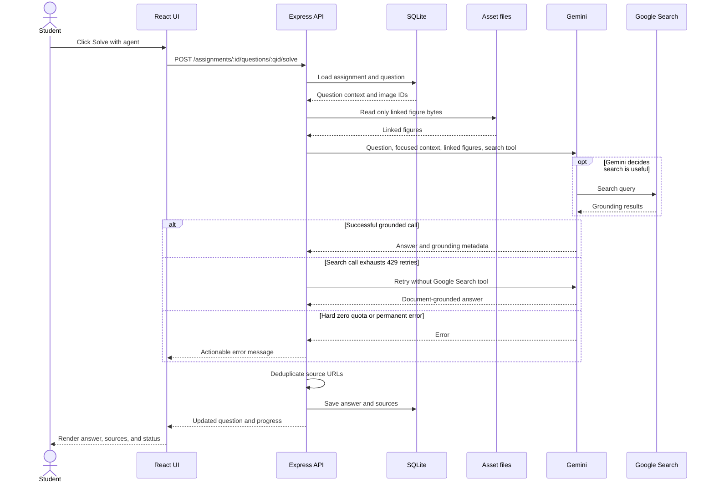
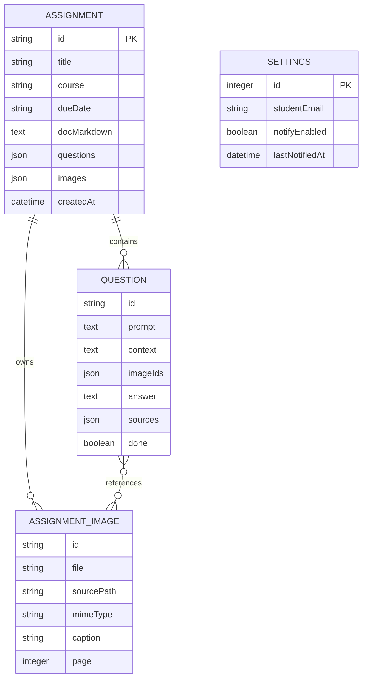
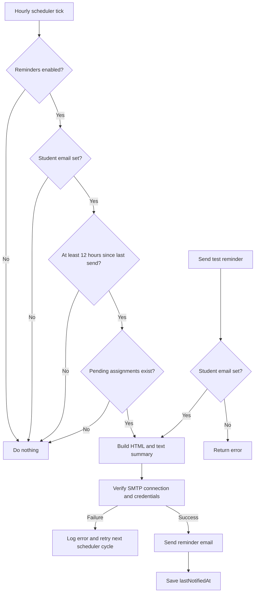

# Smart Assignment Tracker: System Flow

This guide explains how the Smart Assignment Tracker processes documents, extracts
questions and figures, solves a selected question, tracks progress, exports results,
and sends reminder emails.

## End-to-end summary

1. The student uploads a PDF, image, DOCX, TXT, or Markdown file.
2. The server converts the document to Markdown. MinerU provides OCR and figures for
   PDFs and images when configured.
3. Extracted figures are saved on disk. Their metadata, including source path, caption,
   and page, is retained.
4. Gemini converts the document into structured questions. Each question contains a
   focused source excerpt and the IDs of only its relevant figures.
5. The assignment, questions, and figure metadata are saved in SQLite.
6. When the student solves a question, the server sends only that question, its focused
   context, and its linked figures to Gemini.
7. Gemini may use Google Search. The answer and source URLs are saved and displayed.
8. Completion toggles update progress. The browser can export all assignments to PDF,
   and the server can send SMTP reminder emails.

```mermaid
flowchart LR
    Upload[Upload document] --> Ingest[Convert or OCR]
    Ingest --> Content[Markdown and figures]
    Content --> Extract[Extract questions and correlations]
    Extract --> Store[(SQLite and asset files)]
    Store --> Select[Select one question]
    Select --> Payload[Focused text and linked figures]
    Payload --> Solve[Gemini and optional Google Search]
    Solve --> Answer[Save answer, sources, and progress]
```



## System architecture

The application is a React single-page client and an Express API server. Secrets and
external-service calls stay on the server. During development, Vite serves the client
on port `4173` and proxies `/api` requests to Express on port `3001`.



### Main components

| Concern | Implementation |
|---|---|
| React UI | `client/src/App.tsx` |
| Typed API wrapper | `client/src/api.ts` |
| Browser PDF export | `client/src/exportPdf.ts` |
| Express routes and startup | `server/src/index.ts` |
| File-type routing | `server/src/ingest.ts` |
| MinerU client | `server/src/mineru.ts` |
| Figure persistence | `server/src/assets.ts` |
| Question extraction and solving | `server/src/agent.ts` |
| Context and figure fallback correlation | `server/src/questionContext.ts` |
| SQLite persistence | `server/src/store.ts` |
| Progress calculation | `server/src/progress.ts` |
| Email reminders | `server/src/notify.ts` |

## Startup flow

Running `npm run dev` starts the client and server concurrently.

1. The server loads the project-root `.env`.
2. Importing the store opens SQLite, enables write-ahead logging, creates tables, and
   performs schema or legacy JSON migrations when needed.
3. Express enables CORS, JSON parsing, in-memory uploads, and static figure serving.
4. The server starts listening and starts the hourly reminder scheduler.
5. The React client loads assignment summaries and notification settings.

The upload limit is 50 MB. The API key, SMTP password, and MinerU URL never need to be
sent to the browser.

## Upload and ingestion flow

The client submits `multipart/form-data` to `POST /api/assignments`. The server routes
the file according to its MIME type and extension.



### File routing

| Input | Processing | Figures |
|---|---|---|
| PDF with MinerU | OCR and reading-order Markdown | Extracted and persisted |
| PDF without MinerU | `pdf-parse` text layer | None |
| Image with MinerU | OCR and parsing | Extracted and persisted |
| Image without MinerU | Rejected with setup guidance | None |
| DOCX | Mammoth to Markdown | Embedded figures are not persisted |
| TXT or MD | UTF-8 text normalization | None |

A scanned PDF with no useful text layer requires MinerU. If MinerU is configured but
unavailable, the request retries MinerU failures and then fails rather than silently
switching to text-only parsing.

### MinerU figure selection

MinerU returns Markdown, a reading-order content list, and image data. The server keeps
content blocks marked as images, preserving each figure's:

- Generated ID
- Stored file path
- Original Markdown source path
- MIME type
- Caption
- Zero-based page number

If no usable content list exists, the server keeps at most 24 returned images as a
fallback. These fallback images can include table or formula crops.

## Question and figure correlation

Correlation occurs during question extraction. Gemini receives the document plus a
bounded set of figures. Every attached figure is listed in the prompt with its stable
image ID, page, and caption.

Gemini must return structured JSON in this form:

```json
[
  {
    "prompt": "The complete assignment question",
    "context": "The focused, verbatim source excerpt",
    "imageIds": ["relevant-figure-id"]
  }
]
```

Only IDs that exist in the assignment are accepted. An explicit empty `imageIds` array
means that the question does not require a figure.



### Correlation limits

- Extraction reads at most 30,000 Markdown characters.
- At most `GEMINI_MAX_IMAGES` figures are attached, defaulting to six.
- Each attached image is limited to 5 MB.
- All attached images together are limited to 16 MB.
- A question context is limited to 8,000 characters.
- Existing database rows without correlation fields are normalized on read using the
  deterministic fallback.

For the strongest mapping, re-upload older assignments so Gemini can select image IDs
during extraction rather than relying only on fallback correlation.

## Solving one question

The solve endpoint does not send the entire assignment or all figures. It selects only
the requested question's focused context and images whose IDs are in that question's
`imageIds` array.



### Gemini retries

Gemini calls retry transient rate limits (`429`) and service overload (`503`) using a
server-provided delay when available, otherwise exponential backoff. A quota response
with `limit: 0` fails immediately because retrying cannot resolve it.

Google Search has a tighter quota than ordinary generation. If search is rate-limited
after all retries, solving runs again without the search tool so the student can still
receive an answer based on the focused document context and model knowledge.

The response field `usedWebSearch` indicates that the search-enabled request succeeded;
it does not guarantee that Gemini actually issued a search. Grounding URLs are displayed
only when Gemini returns them.

## Data model and persistence

Assignments and settings live in `server/data.sqlite`. Extracted figure bytes live in
`server/data/assets/<assignmentId>/`; only their metadata is stored in SQLite.



SQLite stores the `questions` and `images` collections as JSON columns in one assignment
row. The store normalizes older rows when reading them. Deleting an assignment removes
its database row and recursively deletes its figure directory.

## Progress and completion

Each question has a `done` flag. Toggling it calls the question `PATCH` endpoint, saves
the assignment, and recalculates:

- Total, completed, and remaining questions
- Completion percentage
- Days until the due date
- Status: `done`, `no-date`, `overdue`, `due-today`, `due-soon`, or `on-track`

An assignment is considered pending until all its questions are complete.

## PDF export

PDF export runs entirely in the browser:

1. Fetch all assignment summaries.
2. Fetch each complete assignment concurrently.
3. Build one A4 PDF containing assignment metadata, questions, answers, sources, and
   completion status.
4. Add page breaks and page numbers.
5. Download `assignments-YYYY-MM-DD.pdf`.

The current export does not include extracted figure images. Markdown and LaTeX are
written as source text, and unsupported non-Latin-1 characters are removed because the
built-in jsPDF Helvetica font is used.

## Email notifications

SMTP credentials come from `.env`. Gmail requires an App Password rather than the
account's normal password. Spaces in a grouped App Password are removed before login.

There are two sending paths:

- Manual: `POST /api/notify/test` sends immediately, even if reminders are disabled.
- Scheduled: while the server runs, an hourly timer checks whether a reminder is due.



The scheduler starts after Express begins listening. Its first check occurs after one
hour, and it does not keep the Node process alive by itself.

## API flow

| Method | Endpoint | Purpose |
|---|---|---|
| `POST` | `/api/assignments` | Upload, ingest, correlate, and save an assignment |
| `GET` | `/api/assignments` | List lightweight assignment summaries |
| `GET` | `/api/assignments/:id` | Load a complete assignment |
| `DELETE` | `/api/assignments/:id` | Delete an assignment and its figures |
| `POST` | `/api/assignments/:id/questions/:qid/solve` | Solve one correlated question |
| `PATCH` | `/api/assignments/:id/questions/:qid` | Update an answer or completion state |
| `GET` | `/api/settings` | Load notification settings |
| `PUT` | `/api/settings` | Save notification settings |
| `POST` | `/api/notify/test` | Send a reminder immediately |
| `GET` | `/api/assets/*` | Serve extracted figures |
| `GET` | `/api/health` | Report server and Gemini-key readiness |

## Failure and cleanup behavior

- Missing uploads return `400`; missing assignments or questions return `404`.
- Unsupported formats and missing service configuration return actionable errors.
- MinerU retries network and server failures, but not deterministic client errors.
- If question extraction fails after figures are saved, the figure directory is removed.
- Missing or oversized figure files are skipped when creating a Gemini payload.
- Gemini retries `429` and `503`; hard zero quota fails immediately.
- Scheduler errors are logged and do not terminate the server.
- Legacy JSON migration failures leave the original file intact.

## Important boundaries

- This is currently a single-user local application with no authentication or tenant
  isolation.
- CORS is unrestricted.
- Extracted assets are served from a public API path.
- The Express server does not serve the production `client/dist` directory; production
  deployment needs a static host or reverse proxy for the client.
- The default data store and figure directory are local to the server machine.
